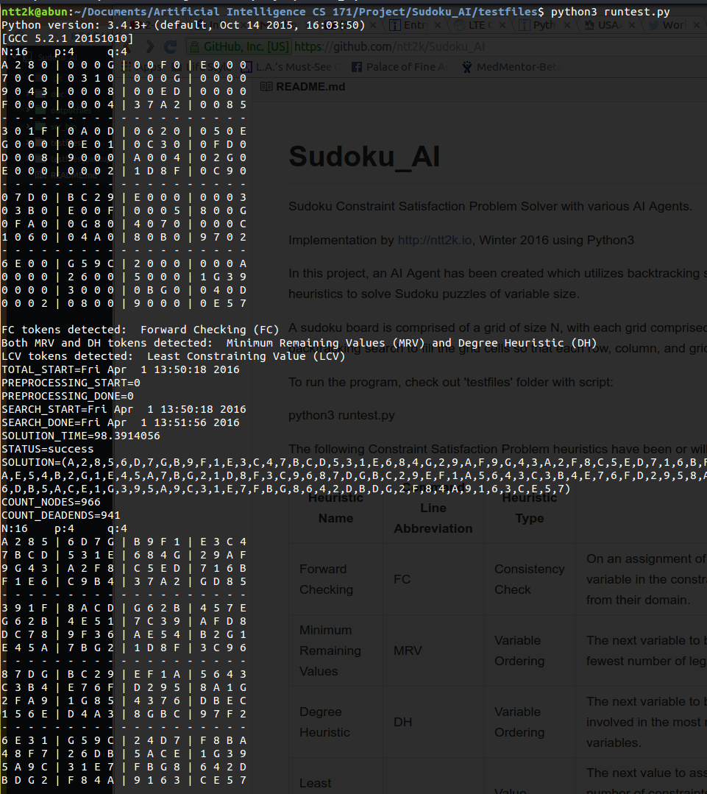

# Sudoku_AI
Sudoku Constraint Satisfaction Problem Solver with various AI Agents.

Implementation by http://ntt2k.io, Winter 2016 using Python3

In this project, an AI Agent has been created which utilizes backtracking search and Constraint Satisfaction Problem heuristics to solve Sudoku puzzles of variable size.

A sudoku board is comprised of a grid of size N, with each grid comprised of p rows and q columns. The agent will attempt backtracking search to fill the grid cells so that each row, column, and grid cell has unique numbers.

To run the program, check out 'testfiles' folder with script:

python3 runtest.py

The following Constraint Satisfaction Problem heuristics have been or will be implemented:

Heuristic Name | Command Line Abbreviation | Heuristic Type | Description
-------------- | ------------------------- | -------------- | -----------
Forward Checking | FC | Consistency Check | On an assignment of a value to a variable, each of the neighbors of the variable in the constraint graph will have inconsistent values removed from their domain.
Minimum Remaining Values | MRV | Variable Ordering | The next variable to be assigned a value will be the variable with the fewest number of legal moves remaining.
Degree Heuristic | DH | Variable Ordering | The next variable to be assigned a value will be the variable which is involved in the most number of constraints with other unassigned variables.
Least Constraining Value | LCV | Value Ordering | The next value to assign to a variable will be selected based on the number of constraints it places on other unassigned variables in the constraint graph, with the value causing the least number of constraints selected.
Arc Consistency | AC | Consistency Check | Arc consistency eliminates values from domain of variable that can never be part of a consistent solution.

- [ ] Heuristic Implementation Progress
  - [X] FC
  - [X] MRV
  - [X] DH
  - [X] LCV
  - [ ] AC

  Version History
  ---------------

  v0.1: First initial commit to GitHub, missing Arc Consistency (AC)
